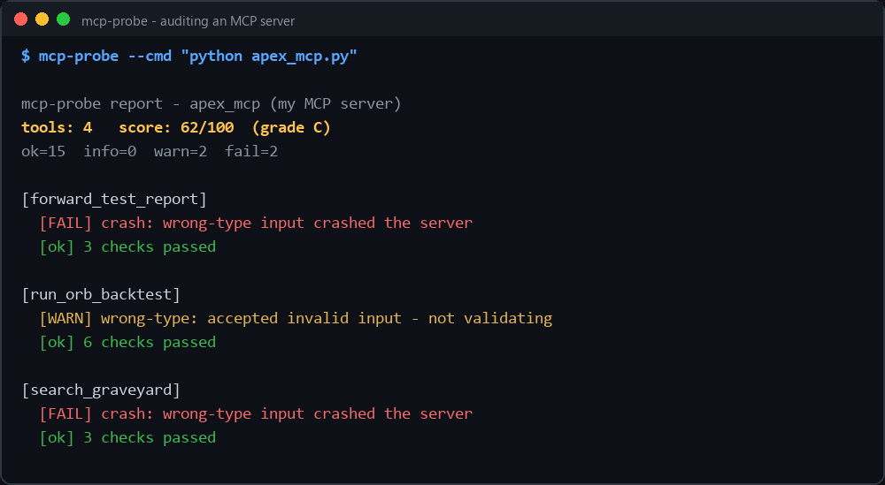

# mcp-probe — audit any MCP server

Thousands of people are building **MCP servers** (the tools AI agents call). Almost nobody
tests them. `mcp-probe` connects to any MCP server, discovers its tools, **fuzzes each one with
schema-derived adversarial inputs**, and produces a scored audit report — the "does this server
actually validate its inputs, or does it crash?" check that the MCP ecosystem is missing.



## What it checks (per tool)

| Check | Good outcome | Bad outcome |
|---|---|---|
| **schema hygiene** | typed params, has a description | untyped / undescribed → WARN |
| **valid baseline** | accepts a schema-valid input | rejects its own valid input → FAIL |
| **rejects invalid** | cleanly errors on missing-required / wrong-type | silently accepts garbage → WARN |
| **robustness** | survives empty / 100k-char / injection-shaped strings | crashes / drops the connection → **FAIL** |

It produces a **0–100 score and an A–F grade**, a terminal summary, and a Markdown audit report
you can attach to a PR or hand to a client.

## Why this exists

An MCP tool that crashes on a wrong-typed argument, or blindly trusts unvalidated input, is a
liability the moment an autonomous agent starts calling it with unexpected values. `mcp-probe`
finds those problems before your users do.

**Dogfood proof:** running it against my own MCP server ([apex-mcp](https://github.com/junaidshahid-dev/mcp-apex-server))
scored it **62/100 (grade C)** — it caught two tools that crash on wrong-type input and two that
accept invalid input without validating. The audit is real because it found real bugs in its
author's code. See [`assets/sample_audit.md`](assets/sample_audit.md).

## Usage

```bash
pip install -r requirements.txt

# audit a server launched over stdio
python -m mcp_probe.cli --cmd "python my_server.py"

# write a Markdown report, and fail CI if the score is too low
python -m mcp_probe.cli --cmd "python my_server.py" --markdown audit.md --fail-under 75

# produce a client-ready HTML audit report (self-contained, no external assets)
python -m mcp_probe.cli --cmd "node dist/index.js" --html audit.html
```

If the server turns out to forward its work to a remote service, mcp-probe stops before fuzzing
it. A full run would send hundreds of adversarial requests — including 100k-character strings —
to somebody else's production infrastructure. Pass `--allow-remote` **only** for a service you
own or have written permission to test.

## Audited in the wild

**Thirteen public MCP servers audited** — including servers from Anthropic, Google, Microsoft,
MongoDB and Upstash. Eleven score 97–100/A. Two have real input-validation gaps and have been
reported privately through their maintainers' stated security channels; they stay unnamed here
until those maintainers have had time to respond.

Three more **would not start at all** on a fresh install — two of Anthropic's own servers and
one of Microsoft's — because they declare an unbounded `mcp>=` dependency and the Python SDK's
2.0 release removed the APIs they use. Pinning `mcp<2` fixes all three, after which each scores
100/A. The code was fine; the packaging was not.

Auditing them also exposed **five false positives, one false negative, and one judgement error**
in mcp-probe itself — all fixed and regression-tested. The judgement error is the one worth
reading: mcp-probe fuzzed a server that turned out to be a thin proxy to a vendor's production
API, sending ~270 adversarial requests to infrastructure that was not mine. It now detects that
in a single call and refuses to continue without `--allow-remote`.

Existing MCP scanners run around a 78% false-positive rate; a scanner that fails well-built
servers trains people to ignore it, so calibration is the product. Full write-up:
[`audit/FINDINGS.md`](audit/FINDINGS.md).

## Design notes

- **Transport-agnostic core.** Everything runs against a small `MCPClient` interface, so the
  checks are fully testable offline with an in-memory fake server — no live server, no network,
  no SDK required to run the test suite.
- **Fuzzing is schema-driven**, not random: each adversarial case targets one named failure mode
  (`missing-required`, `wrong-type`, `huge-string`, `injection-shaped`, …) so findings are
  actionable, not noise.
- **A crash stops the run** for that server — mcp-probe won't keep hammering a process it just
  knocked over.
- **ASCII-only console output** — a CLI tool must not itself crash on a Windows codepage.

## Tests

```bash
python -m pytest tests/ -q
```

The suite audits a well-behaved server (expects grade A) **and** a deliberately broken one
(expects the crash + missing-validation to be caught) — proving the auditor catches what it claims.

---
Built by **M. Junaid Shahid** — Python backend & AI tooling.
Portfolio: [junaidshahid-dev.github.io](https://junaidshahid-dev.github.io) ·
Related: [mcp-apex-server](https://github.com/junaidshahid-dev/mcp-apex-server) ·
[ragbox](https://github.com/junaidshahid-dev/ragbox)
